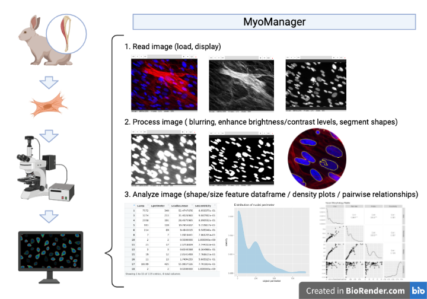

# MyoManager

<!-- badges: start -->
<!-- badges: end -->

## Description

**MyoManager** is a R toolbox for reading, visualizing, and analyzing
microscopy images focused on muscle stem cells in their native
microenvironment — the muscle tissue niche. Specifically, three areas of
analysis will be implemented: cell counting (by counting \#nuclei),
nuclei morphology (by extracting quantitative shape/size features of
segmented objects from image data), and signal co-localization (under
construction). While muscle stem cells are well characterized in
literature, imaging these characteristics is a laborious task for
researchers, the goal of this tool is to automate image analysis of
hard-to-distinguish structures in muscle stem cells and provided better
insight into their biology and behaviors.

Bio-image analysis is not novel to the R environment. Packages like
**EBImage** contain a wide assortment of processing functions. However
they are not sufficient enough for complex, hard-to-distinguish
structures such as muscle stem cells. **MyoManager** is a highly
specific package built for analyzing muscle stem cells in varying
developmental stages in the tissue, which has not been previously
attempted. Not only does this package handle visualization and basic
image manipulations, it combines several general purpose functionalities
of **EBImage** to simplify the image analysis workflow and extract image
data useful for understanding muscle stem cells.

Anticipated audience of **MyoManager** are students and researchers who
are interested in muscle stem cells and seek custom analysis with
tailored output. . The package was developed using R version 4.1.1 and
Mac platform.

## Installation

To install the latest version of the package:

``` r
require("devtools")
install_github("karenkuang37/MyoManager", build_vignettes = TRUE)
library("MyoManager")
```

To run the shinyApp: \# Under construction

## Overview

``` r
ls("package:MyoManager")
data(package = "MyoManager") 
```

There are (currently) 4 groups of functions available to the user:

**1. loadAnadDisplay** handles the loading and viewing of microscopy
images. Functions ***loadImage*** and ***viewImage*** from this R script
allow users to load and view a variety of image formats including jpg,
png, and tiff files in single or multi-frame interactive display
windows.

**2. imageProcessing** permits users to perform simple image
manipulations including frame selection ( ***selectFrame*** ), blurring
( ***blurImage*** ), brightness and contrast adjustments (
***intensityCtrl*** ). These can enhance the visual quality of
microscopy images, serving as preparation for later analysis.

**3. segmentImage** contains a single function: ***segmentImage***,
which is available for the user to generate segmented (separating lines
between distinct objects) visuals of cell and nuclei shapes.

**4. nucleiTool** contains several functions to support the counting of
cell nuclei ( ***countNuclei*** ); measurement of nuclei morphological
features included area, perimeter, mean radius, and eccentricity (
***getFeatureData*** ); density distribution of one of these features (
***plotFeatureMatrix*** ); and a matrix of pairwise scatter plots,
density plots, and correlation values of these shape/size features (
***plotFeatureMatrix*** ).

**5.** Other functionalities more specific to muscle stem cells will be
implemented, including calculation of fusion index (ratio of \[\#stem
cells fused with muscle fiber\]:\[\#stem cells outside muscle fiber\]),
signal co-localization (how the distribution of signals in fluorescence
microscopy images can be used to determine whether two probes
codistribute with one another.), and others.

For more details about the functions, please take a look at the vignette
for this package:

``` r
browseVignettes("MyoManager")
```

The package tree structure is provided below:

``` r
- MyoManager
  |- MyoManager.Rproj
  |- DESCRIPTION
  |- NAMESPACE
  |- LICENSE
  |- README
  |- data
    |- GeneCounts.rda
  |- inst
    CITATION
    |- extdata
      |- Human_01.tiff
      |- Mouse_01.tiff
      |- Rabbit_01.tif
      |- Human_01.jpg
      |- Mouse_01.jpg
      |- Rabbit_01.jpg
  |- man
    |- loadImage.Rd
    |- viewImage.Rd
    |- validImage.R
    |- blurImage.Rd
    |- countNuceli.Rd
    |- getFeatureData.Rd
    |- intensityCtrl.Rd
    |- is.wholenumber.Rd
    |- plotFeature.Rd
    |- plotFeatureMatrix.Rd
    |- segmentImage.Rd
    |- selectFrame.Rd
  |- R
    |- imageProcessing.R
    |- loadAndDisplay.R
    |- nucleiTool.R
    |- segmentImage.R
  |- vignettes
    |- Intrduction_MyoManager.Rmd
    |- muscle-dystrophin.jpeg
    |- muscle_stem_cell_Growth.jpeg
  |- tests
    |- testthat.R
    |- testthat
      |- test-loadAndDisplay.R
      |- test-imageProcessing.R
      |- test-segmentImage.R
      |- test-nucleiTool.R
```

An overview of the package is illustrated below.


## Contributions

The author of the package is Yinni Kuang.

Function ****loadImage**** is a wrap around *magick* package’s
**image\_read** and **as\_EBImage** to load one or more images from
files, and store the image objects as class Image from EBImage packge.
Function ****loadImage**** is a wrap around *EBImage* package’s
**display**, which takes a Image and prompts R’s graphic display window
to open, this device supports single and multi-frame images as well as
different degrees of zoom, making it easy to visualize detailed
microscopy data.

Function ****blurImage**** *EBImage*’s **makeBrush** to generates a 2D
matrix containing the magic brush of desired shape and size, then to
apply the blurring filter to a selected image, **filter2** is used.

Function ****segmentImage**** employs several functions from *EBImage*
to produce an ideal segmented image. First, **otsu** computes a
threshold value based on Otsu’s method, which can be then used to reduce
grayscale image to binary image. Then, I used **fillHull** to fill in
holes left in the binary mask and **bwlabel** to label connect nuclei
objects in the foreground. Next, I used **opening** to perform image
erosion followed by a dilation, and **propagate**, which is code sourced
by EBImage from image analysis software CellProfiler permission granted
to distribute this particular part. Propagate uses identified nuclei as
‘seeds’ to find boundaries between adjacent regions in an image.
Finally, I used **paintObject** to higlight nuclei objects in images by
outlining them.

Function ****countNuclei****, and ****getFeatureData**** also uses the
Otsu algorithm to compute threshold values and binary mask prior to
counting and measuring nuclei. (Same steps as described above) *EBImage*
functions **otsu**, **fillHull**, **opening**, and **bwlabel** were
employed in the making of binary mask.

Function ****getFeatureData**** also uses the **computeFeatures** and
its subsidiary **computeFeatures.shape** from *EBImage* calculate the
quantitative measurements of nuclei area, perimeter, radius, and
eccentricity.

Plotting function ****plotFeature**** generated density plots using the
*ggplot2* package, while function ****ploteFeatureMatrix**** produced a
matrix of scatter plots and density distribution using **ggpairs** from
the handy *GGally* library.

## References

Jeroen Ooms (2021). magick: Advanced Graphics and Image-Processing in R.
R package version 2.7.3. Ref link:
<https://CRAN.R-project.org/package=magick>

Gregoire Pau, Florian Fuchs, Oleg Sklyar, Michael Boutros, and Wolfgang
Huber (2010): EBImage - an R package for image processing with
applications to cellular phenotypes. *Bioinformatics*, 26(7),
pp. 979-981, Ref link: <https://pubmed.ncbi.nlm.nih.gov/20338898/> URL:
<https://bioconductor.org/packages/release/bioc/html/EBImage.html>

Xiaolu Yang, Xuanjing Shen, Jianwu Long, Haipeng Chen, (2012): An
Improved Median-based Otsu Image Thresholding Algorithm, *AASRI
Procedia*,Volume 3, pp. 468-473, Ref link:
<https://doi.org/10.1016/j.aasri.2012.11.074>} URL:
<https://www.sciencedirect.com/science/article/pii/S2212671612002338>}

Dunn KW, Kamocka MM, McDonald JH, (2011): A practical guide to
evaluating colocalization in biological microscopy. *Am J Physiol Cell
Physiol*. 300(4):C723-C742. <doi:10.1152/ajpcell.00462.2010> URL:
<https://www.ncbi.nlm.nih.gov/pmc/articles/PMC3074624/>

Yin H, Price F, Rudnicki MA. (2013) Satellite cells and the muscle stem
cell niche. *Physiol Rev*. ;93(1):23-67.
<doi:10.1152/physrev.00043.2011>. URL:
<https://www.ncbi.nlm.nih.gov/pmc/articles/PMC4073943/>

Nguyen John H., Chung Jin D., Lynch Gordon S., Ryall James G, (2019):
The Microenvironment Is a Critical Regulator of Muscle Stem Cell
Activation and Proliferation. *Front. Cell Dev. Biol.*, Volume 7, pp.254
<doi:10.3389/fcell.2019.00254>
URL:<https://www.frontiersin.org/article/10.3389/fcell.2019.00254>

H. Wickham. ggplot2: Elegant Graphics for Data Analysis. Springer-Verlag
New York, 2016. URL: <https://ggplot2.tidyverse.org/>

R Core Team (2019). R: A language and environment for statistical
computing. *R Foundation for Statistical Computing*, Vienna, Austria.
URL <https://www.R-project.org/>.

## Acknowledgements

This package was developed as part of an assessment for 2021 BCB410H:
Applied Bioinformatics, University of Toronto, Toronto, CANADA.
