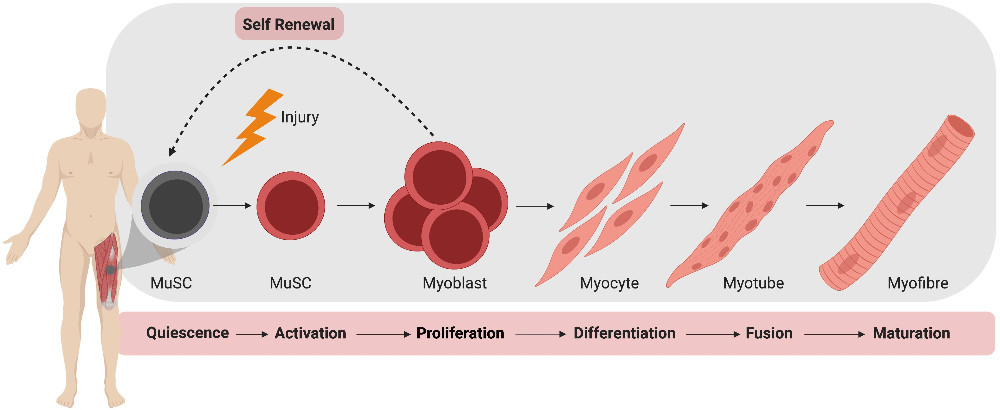

```{r setup, include=FALSE}
library(knitr)
opts_chunk$set(fig.align = "center", 
               out.width = "90%",
               fig.width = 6, fig.height = 5.5,
               dev.args=list(pointsize=10),
               par = TRUE, # needed for setting hook 
               collapse = TRUE, # collapse input & ouput code in chunks
               warning = FALSE)

knit_hooks$set(par = function(before, options, envir)
  { if(before && options$fig.show != "none") 
       par(family = "sans", mar=c(4.1,4.1,1.1,1.1), mgp=c(3,1,0), tcl=-0.5)
})
set.seed(1) # for exact reproducibility
```
       
## Introduction

Ah, the marvel of muscles! Our skeletal muscle tissue allows us to walk, smile, and breathe. They are developed from Muscle stem cells (MuSCs). *[Fig 1.]* When we want to move, our brains send signals to the neuromuscular junction to active a cascade of signals within each muscle fiber to produce coordinated muscle contraction. As if this weren’t cool enough, when skeletal muscle is injured, muscle stem cells residing in the tissue are called to action to regenerate muscle form and function. While these cells are well characterized literature, imaging these characteristics is a laborious task for researchers, the goal of this tool is to automate image analysis of hard-to-distinguish structures in muscle stem cells and provided better insight into their biology and behaviors. 

```{r echo=FALSE, out.width='100%'}

```

## Package functions

**MyoManager** is a simple R package toolbox for reading, visualizing, and analyzing microscopy image data focused on muscle stem cells in their microenvironment --- muscle tissue niche. Specifically, three areas of analysis will be implemented: cell counting (via nuclei), nuclei morphology, and co-localization (under construction). 

Functions __*loadImage*__ and __*viewImage*__ from __loadAndDisplay__ allow users to read and display a variety of image formats including jpg, png, and tiff files. Reading is handled by underlying function from the **Magick** R package as it can handle over 200 image formats. Images are as multi-dimensional arrays containing the pixel intensities, an objects class that allows easy access to image data, defined by the R package **EBImage**.


Functions from  __imageProcessing__  permits users to perform simple manipulations including frame selection, blurring, brightening/dimming, and increasing contrast to enhance the visual quality of microscopy images. These steps can serve as preparations for image analysis. 

Function __*segmentImage*__ is available to produce segmented visuals of cell and nuclei shapes. Segmentation of individual image channels is often useful when it is difficult
to distinguish cell shape and structures by eye. (e.g. Visualizing segmentation helps users
locate nuclei within a mesh of muscle fibers)

Function __*countNuclei*__ implements the major task of counting the number of nuclei objects in an image....keep writing 

The shiny implementation of *MyoManager* is available as __*runMyoManager*__ (not yet constructed). For more information, see details below. **This document gives a tour of MyoManager (version 0.1.0) functionalities**. It was written in R Markdown, using the [knitr](https://cran.r-project.org/package=knitr) package for production. 


See `help(package = "MyoManager")` for further details and references provided by `citation("MyoManager")`. To download **MyoManager**, use the following commands:

``` r
require("devtools")
install_github("karenkuang37/MyoManager", build_vignettes = TRUE)
library("MyoManager")
```
To list all functions available in the package:
``` r
lsf.str("package:MyoManager")
```

```{r }
library(MyoManager)
```
