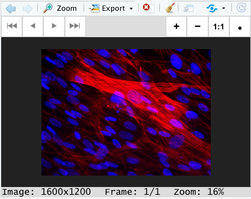
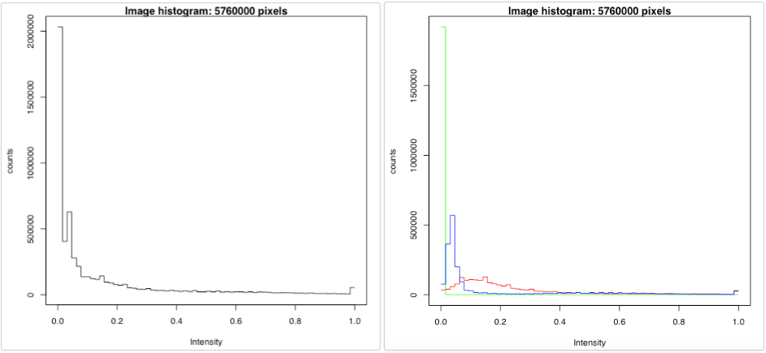
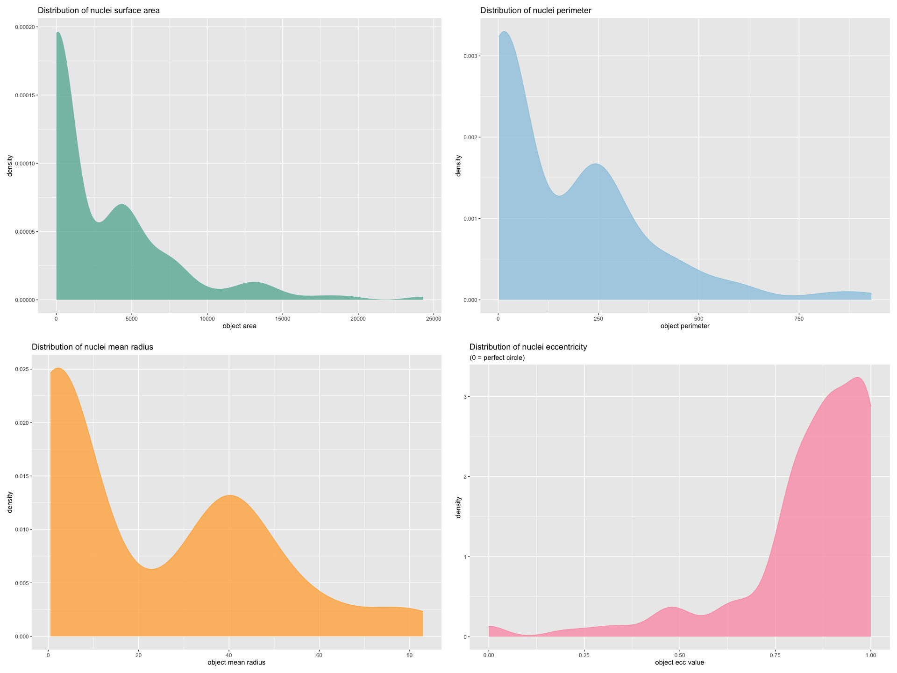

```{r, include=FALSE}
library(knitr)
opts_chunk$set(fig.align = "center", 
               out.width = "90%",
               fig.width = 6, fig.height = 5.5,
               dev.args=list(pointsize=10),
               par = TRUE, # needed for setting hook 
               collapse = TRUE, # collapse input & output code in chunks
               warning = FALSE)

knit_hooks$set(par = function(before, options, envir)
  { if(before && options$fig.show != "none") 
       par(family = "sans", mar=c(4.1,4.1,1.1,1.1), mgp=c(3,1,0), tcl=-0.5)
})
set.seed(1) # for exact reproducibility
```

```{r setup, echo=FALSE, message=FALSE}
library(MyoManager)
library(EBImage)
library(magrittr)
library(ggplot2)
library(dplyr)
library(methods)
library(GGally)
```

## Introduction

Ah, the marvel of muscles! Our skeletal muscle tissue allows us to walk, smile, and breathe. They are developed from Muscle stem cells (MuSCs). *[Fig 1.]* When we want to move, our brains send signals to the neuromuscular junction to active a cascade of signals within each muscle fiber to produce coordinated muscle contraction. As if this isn’t cool enough, when skeletal muscle is injured, muscle stem cells residing in the tissue are called to action to regenerate muscle form and function. While these cells are well characterized literature, imaging them is a laborious task for researchers, the goal of this tool is to semi-automate image analysis of hard-to-distinguish structures in muscle stem cells and provided better insight into their biology and behaviors. 

```{r echo=FALSE, out.width='100%'}
knitr::include_graphics('./muscle_stem_cell_Growth.jpeg')
```
[Figure 1: Muscle stem cell growth (Obtained from Nguyen et al, 2019) ](https://www.frontiersin.org/articles/10.3389/fcell.2019.00254/full)

<br>

## Functions at a glance

*MyoManager* is a straightforward R toolbox for reading, visualizing, and analyzing microscopy image data focused on muscle stem cells in their innate micro-environment --- the muscle tissue niche. Specifically, three areas of analysis will be implemented: cell counting (via nuclei), nuclei morphology, and co-localization (under construction). 

Functions __*loadImage*__ and __*viewImage*__ allow users to read and display a variety of image formats including jpg, png, and tiff files. Reading is handled by underlying function from the *Magick* R package as it can handle over 200 image formats. Images are as multi-dimensional arrays containing the pixel intensities, an objects class that allows easy access to image data, defined by the R package *EBImage*.

Functions for image processing permits users to perform simple manipulations including frame selection(__*selectFrame*__), blurring(__*blurImage*__), and brightness and/or contrast adjustments(__*intensityCtrl*__) to enhance the visual quality of microscopy images. These steps can serve as preparations for image analysis. 

Function __*segmentImage*__ is available to produce segmented visuals of cell and nuclei shapes. Segmentation of individual image channels is often useful when it is difficult to distinguish cell shape and structures by eye. (e.g. Visualizing segmentation helps users locate nuclei within a mesh of muscle fibers)

Function __*countNuclei*__ is in charge of counting the number of nuclei objects in an input image. It implements the [Otsu](https://ieeexplore.ieee.org/document/4310076) method, which is a global adaptive binarization threshold image segmentation algorithm, put forward by Japanese scholars Otsu in 1979. Function __*getFeatureData*__ retrieves the <span style="color:green">area</span>, <span style="color:blue">perimeter</span>, <span style="color:orange">mean radius</span>, and <span style="color:purple">eccentricity</span> of each nuclei object in the input image, allowing function __*plotFeature*__ to plot the density distribution of selected feature and function __*plotFeatureMatrix*__ to showcase the distribution and correlation of all four shape/size features of the nuclei. 

The shiny implementation of *MyoManager* is available as __*runMyoManager*__. For more information, see details below. **This document gives a tour of MyoManager (version 0.1.0) functionalities**. It was written in R Markdown, using the [knitr](https://cran.r-project.org/package=knitr) package for production. 

See `help(package = "MyoManager")` for further details and references provided by `citation("MyoManager")`. To download *MyoManager*, use the following commands:

```{r eval=FALSE}
require("devtools")
install_github("karenkuang37/MyoManager", build_vignettes = TRUE)
library("MyoManager")
```
To list all functions available in the package:
``` {r}
lsf.str("package:MyoManager")
```
<br>

## Image Analysis Workflow

### Step 1. Load and view images from path/url

As a starter, microscopy image can be loaded into the R environment using: 
```{r load_image}
rabbit <- loadImage(system.file('extdata/Rabbit_01.tif', package = 'MyoManager'))
```
single and multiple images are equally supported provided one or more paths or URLs to image files is given. Images are stored as objects of \code{Image} class, as defined by R package *EBImage*, they are multi-dimensional arrays containing the pixel intensities. This form makes images easier to manipulate.

To view uploaded image(s), the generic plot(rabbit) function is applicable to display one the first frame of a composite image. For a more interactive visualization:
```{r view_image, eval=FALSE}
# 0 for Grayscale or 2 for Color
viewImage(rabbit, color_mode = 2)
```
this function prompts R's graphic display window to open, which supports multi-frame viewing as well as different degrees of zoom, making it easy to closely examine the microscopy image.
```{r echo=FALSE, out.width='80%'}

```


### Step 2. Image processing 

Microscopy images are usually composed of multiple channels of fluorescence. To focus on one channel (e.g. nuclei), we can select its frame number based our  initial view of the image:
```{r frame_select,figures-side, fig.show="hold", fig.height=2}
# After viewing Rabbit_01.tif in Grayscale, we see that 
# cell bodies (muscle fibers) are in frame #1 of the composite image
rFib = selectFrame(rabbit,1)
# While nuclei are in frame #3
rNuc = selectFrame(rabbit,3)

par( mfrow = c(1,2))
viewImage(rFib)
viewImage(rNuc)
```

Options for simple manipulations of the image include adjusting its brightness and/or contrast:
```{r intesity_control, out.width='60%', out.height='50%'}
# Decrease brightness and increase contrast (good for object identification)
rabbit_enhanced = intensityCtrl(rNuc, -0.2, 3)
viewImage(rabbit_enhanced)
```
Another option in image processing is blurring. It may sound counter intuitive, but blurring is useful prior to analyzing individual objects in an image with ill-defined edges and/or uneven intensities. It applies a filter of choice to the image, some are for performing low-pass filtering (to blur images, remove noise...), others perform high-pass filtering (detect edges, sharpen images...). Here is an example:
```{r blurring, out.width='60%', out.height='50%'}
rNuc_blur = blurImage(rNuc, 11, 'line')
viewImage(rNuc_blur)
```

The last processing option MyoManager presents is segmentation —— unique for pronounced cellular structures like the muscle stem cell. Segmentation of individual image channels is often useful when it is difficult to distinguish structures by eye. (e.g. locating nuclei within a mesh of muscle fibers). Here is an example:
```{r segment_image, out.width='60%', out.height='50%'}
# cell segmentation with highlighted nuclei is generated
segmented_rabbit <- segmentImage(rabbit, 1, 3)
viewImage(segmented_rabbit)
```


### Step 3. Image analysis and data extraction

[3.1] The distribution of pixel intensities (univariate if in Grayscale; by color channel if in Color) can be plotted in a histogram using base R function hist(), and their range can be inspected using range().
```{r, eval=FALSE}
hist(rabbit)
range(rabbit)
## [1] 0 1
```
```{r echo=FALSE, out.width='100%'}

```
[3.2] Counting the number of nuclei seems to be an easy task. But researchers often produce data in bulk, no one enjoys the task of manually tallying nuclei counts in tens of hundreds of images. Here MyoManager provides an automated alternative to manual counting with:
```{r nuclei_count}
# note the input image has to be the frame with only nuclei signals
countNuclei(rNuc)
```
The [Otsu](https://ieeexplore.ieee.org/document/4310076) counting algorithm employed here is reasonably accurate with an error margin of 5~10% when compared with manual counting. 

[3.3] In addition to nuclei counting, MyoManager offers a selection of shape/size features to be extracted from the target images: <span style="color:blue">perimeter</span>, <span style="color:orange">mean radius</span>, and <span style="color:purple">eccentricity</span> ( elliptical eccentricity is a measurement of circularity defined by sqrt(1-minoraxis^2/majoraxis^2). This value approaches 0 for rounder objects and 1 for elongated ones. The user can obtain a data frame of features using:
```{r feature_data}
rNucFeatures_df = getFeatureData(rNuc)
tail(rNucFeatures_df)
```
Subsequently, each feature can be visualized in density distributions using:
```{r plot_feature, eval=FALSE}
plotFeature(rNucFeatures_df, "area")
plotFeature(rNucFeatures_df, "perimeter")
plotFeature(rNucFeatures_df, "radius")
plotFeature(rNucFeatures_df, "roundness")
```
```{r echo=FALSE,figures-side,out.width='115%'}

```

[3.4]Aside from interest in individual morphological features of the cell nuclei, it is often useful for researchers to visualize the correlation between these features to fully understand nuclei structures at a specific cellular state. For example, recent research in muscle stem cells points to strong correlation between nuclear size and circularity as an indicator that the stem cells are transcriptionally active.

The following function plots a matrix of pairwise scatter plots and density distribution of the four shape/size features of cell nuclei computed from getFeatureData(): area, perimeter, radius, and eccentricity. Correlation value of the four features is also calculated.
```{r features_matrix}
plotFeatureMatrix(rNucFeatures_df)
```
<br>

## Package References

[Yinni, K. (2021) MyoManager: A microscopy image analysis R Package developed for BCB410H, (Unpublished)](https://github.com/karenkuang37/MyoManager)

<br>


## References

Nguyen John H., Chung Jin D., Lynch Gordon S., Ryall James G.(2019): The Microenvironment Is a Critical Regulator of Muscle Stem Cell Activation and Proliferation. *Cell Dev. Biol*, Volume 7, pp.254, Ref link:https://www.frontiersin.org/article/10.3389/fcell.2019.00254

Jeroen Ooms (2021). magick: Advanced Graphics and Image-Processing in R. R package version 2.7.3. Ref link: https://CRAN.R-project.org/package=magick

Gregoire Pau, Florian Fuchs, Oleg Sklyar, Michael Boutros, and Wolfgang Huber (2010): EBImage - an R package for image processing with applications to cellular phenotypes. *Bioinformatics*, 26(7), pp. 979-981, Ref link: https://pubmed.ncbi.nlm.nih.gov/20338898/ URL: https://bioconductor.org/packages/release/bioc/html/EBImage.html

N. Otsu, "A Threshold Selection Method from Gray-Level Histograms, (1979)" in *IEEE Transactions on Systems, Man, and Cybernetics*, vol. 9, no. 1, pp. 62-66, doi: 10.1109/TSMC.1979.4310076. Ref link: https://ieeexplore.ieee.org/document/4310076.

Yin H, Price F, Rudnicki MA. (2013) Satellite cells and the muscle stem cell niche. *Physiol Rev*. ;93(1):23-67. doi:10.1152/physrev.00043.2011. URL: https://www.ncbi.nlm.nih.gov/pmc/articles/PMC4073943/

Nguyen John H., Chung Jin D., Lynch Gordon S., Ryall James G, (2019): The Microenvironment Is a Critical Regulator of Muscle Stem Cell Activation and Proliferation. *Front. Cell Dev. Biol.*, Volume 7, pp.254
doi:10.3389/fcell.2019.00254 URL:https://www.frontiersin.org/article/10.3389/fcell.2019.00254     

H. Wickham. ggplot2: Elegant Graphics for Data Analysis. Springer-Verlag New York, 2016. URL: https://ggplot2.tidyverse.org/

R Core Team (2019). R: A language and environment for statistical computing. *R Foundation for Statistical Computing*, Vienna, Austria. URL https://www.R-project.org/.

```{r}
sessionInfo()
```
